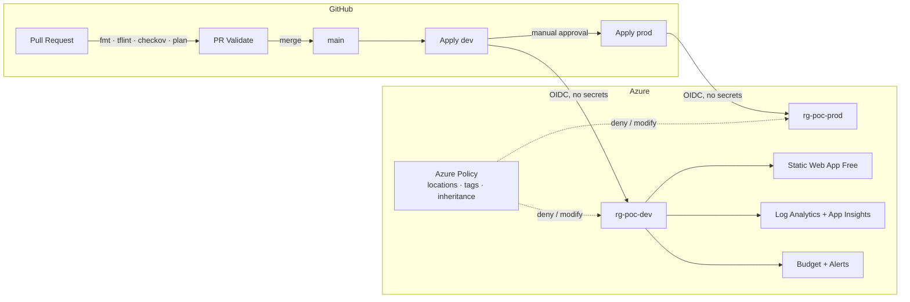

# Azure Platform Engineering — Golden Path PoC

A personal lab project exploring how a small platform engineering team could offer
**paved roads** for Azure workloads: reusable Terraform modules, Terragrunt-based
environment orchestration, and a fully automated DevSecOps pipeline — at (near) zero cost.

## What this demonstrates

| Capability | Implementation |
|---|---|
| **Infrastructure as Code** | Terraform modules with validated inputs & safe defaults |
| **DRY multi-env orchestration** | Terragrunt (`live/dev`, `live/prod`) with a single root config |
| **CI/CD** | GitHub Actions: PR validation → auto-deploy dev → approval-gated prod |
| **DevSecOps** | OIDC federation (zero stored credentials), Checkov IaC scanning → GitHub Security tab, Entra-ID-only state storage (shared keys disabled) |
| **Governance / Policy as Code** | Azure Policy assignments: allowed locations, required tags, tag inheritance with auto-remediation |
| **Observability** | Log Analytics + workspace-based Application Insights with hard ingestion caps |
| **FinOps** | Consumption budgets with actual + forecast alerts, mandatory cost-center tagging, free-tier SKUs throughout |

## Architecture



## Repository layout

```
modules/            Reusable golden-path building blocks
  resource-group/     RG with enforced governance tags
  static-web-app/     Free-tier workload
  observability/      Log Analytics + App Insights (capped ingestion)
  budget/             FinOps budget with actual & forecast alerts
  governance/         Azure Policy assignments (policy as code)
live/               Terragrunt live configuration
  root.hcl            Remote state, provider generation, common tags
  dev/ | prod/        Per-environment units (DRY — only env.hcl differs)
  global/             Subscription-scoped governance
.github/workflows/  PR validation & deployment pipelines
scripts/            Idempotent day-zero bootstrap (state backend + OIDC identity)
app/                Static site with Application Insights telemetry
```

## Security design decisions

- **No secrets anywhere**: GitHub Actions authenticates via OIDC federated credentials
  scoped to specific repo contexts (`pull_request`, `environment:dev`, `environment:prod`).
- **State storage hardened**: shared-key access disabled, Entra ID RBAC only,
  blob versioning enabled, TLS 1.2 minimum.
- **Policy as code**: guardrails are deployed from the same repo they protect —
  non-compliant deployments are denied at ARM level, not just at review time.
- **Shift-left**: tag & naming requirements are validated in the module inputs
  (fail at `plan`), enforced again by Azure Policy (fail at `apply`).

## Cost

Everything runs on free tiers / free grants (Static Web App Free SKU, Log Analytics
5 GB/month grant with a 0.5 GB/day hard cap, budgets & policies are free).
A 1 € monthly budget with 50% actual / 100% forecast alerts acts as a tripwire.

## Bootstrap

One-time setup (state backend + OIDC identity), then everything else flows through CI:

```powershell
az login
./scripts/bootstrap.ps1
```
